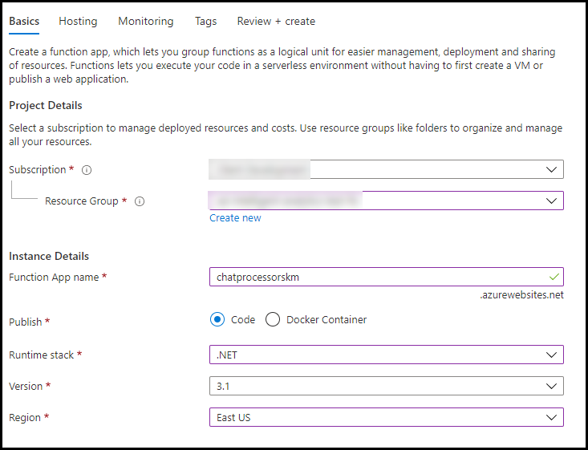
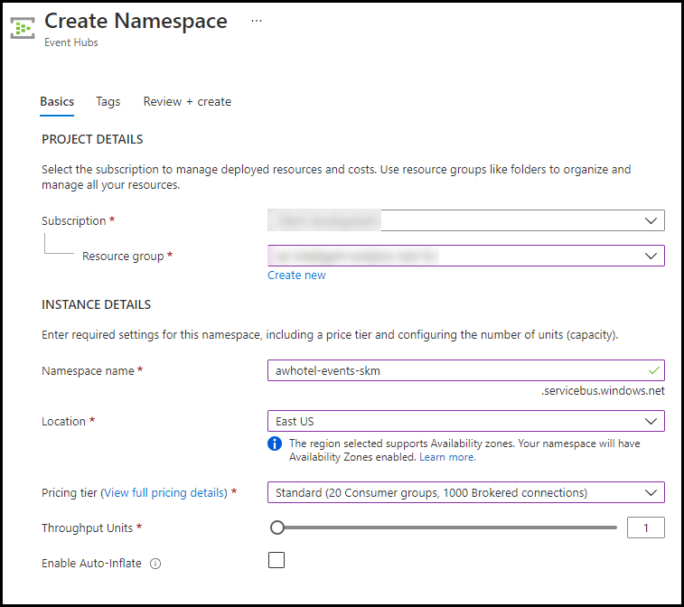
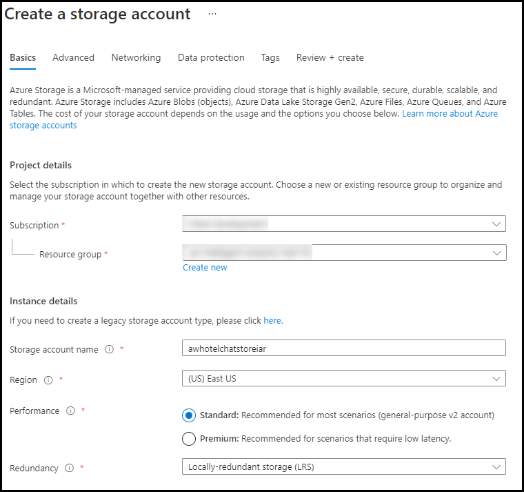

## Exercise 1: Environment setup

Duration: 60 minutes

The following section walks you through the manual steps to provision the services required in the [Azure portal](https://portal.azure.com).  First Up Consultants have provided a starter solution for you. They have asked you to use this as the starting point for creating the Concierge Plus intelligent chat solution in Azure.


### Task 1: Open the ConciergePlus starter solution

1. Unzip the contents of the downloaded ZIP file to the folder **C:\\ConciergePlus**\\.

   >**Note**: Make sure to extract to this exact path. If you extract to a longer directory path, you will hit a Windows max 260 character path limit when you try to build the Visual Studio solution. You will not be able to download the NuGet packages. Keep the solution directory path short.

     Folders window")

2. Open **ConciergePlusSentiment.sln** in the `C:\ConciergePlus\MCW-Intelligent-analytics-main\Hands-on lab\lab-files\starter-project` folder with Visual Studio 2019.

3. Sign in to Visual Studio or select create account, if prompted.

4. If presented with the Start with a familiar environment dialog, select Visual C\# from the Development Settings drop down list, and select Start Visual Studio.

    

5. If the Security Warning window appears, uncheck Ask me for every project in this solution, and select OK.

    

    

> **Note**: If you attempt to build the solution at this point, you will see many build errors. This is intentional. You will correct these in the exercises that follow.

> **Note**: Visual Studio Installer will show the installed version of Visual Studio and if the Azure SDK is installed. If the Azure SDK is missing, go back to the **Before the HOL** and make sure you created the correct VM. Updating Visual Studio manually may install components that may not work with the lab.

### Task 2: Create App Services

In these steps, you will provision a Web App within a single App Service Plan.

1. Sign in to the Azure Portal.

2. Select **+Create a resource**, then search for `Web` and choose **Web App**. Select the **Create** button.

    

3. On the Create Web App blade, enter the following:

    - **Subscription**: Select your subscription.
    - **Resource Group**: Select Use existing, and select the **intelligent-analytics** resource group created previously.
    - **Name**: Provide **a unique name** that is indicative of this resource being used to host the Concierge+ chat website (e.g., `conciergepluschatapp + (namespace)`).
    - **Publish**: Choose the **Code** option.
    - **Runtime stack**: **.NET Core 3.1**
    - **OS**: **Windows**
    - **Region**: Choose a region close to you.
    - **App Service plan**: Create a new App Service Plan.
    - **Sku and Size**: **Standard S1**

    - Select **Review and Create** to provision both Web App and the App Service Plan. Select the **Create** button.

4. When provisioning completes, navigate to your new Web App in the portal by selecting **App Services** from the left menu, and then selecting your web app from the list.

    

5. On the App Service screen, select **Configuration** from the left menu, and then select the **General settings** tab.

    

6. Select the toggle for **Web Sockets** to **On**.

   > **Note**: Failure to complete this step will not allow the JavaScript client to communicate with the web application and receive continuous data exchange.

7. Select **Save**.

### Task 3: Provision Function App

In this section, you will provision a Function App that will be used as the EventProcessorHost for processing and enriching Event Hubs data.

1. From the Azure Portal left menu, select **+ Create a resource**, and search for `Function App`. Choose the **Function App** search result and select the **Create** button.

    

2. On the Function App form, enter the following on the **Basics** tab:

    - **Subscription**: Select your subscription.

    - **Resource Group**: Select Use existing, and select the **intelligent-analytics** resource group created previously.

    - **App Name**: Provide **a unique name** that is indicative of this resource being used to process chat messages (e.g., `chatprocessor`).

    - **Publish**: **Code**
  
    - **Runtime Stack**:  Select **.NET**.
  
    - **Version**: Select **3.1**.

    - **Region**: Select the location you used for the resource group created previously.

    - Select **Review + create** to provision the Function App.

    

### Task 4: Provision Service Bus

In this section, you will provision a Service Bus Namespace and Service Bus Topic.

1. Continuing in the [Azure portal], select **+ Create a resource** from the left menu.

2. Search for **Service Bus** and select the **Create** button.

    

3. On the Create namespace blade enter the following:

    - **Name**: Provide a unique name for the namespace (e.g., `awhotel-namespace`). Namespace could be your initials.

    - **Pricing tier**: Select **Standard**.

    - **Subscription**: Select the Azure subscription you are using for this hands-on lab.

    - **Resource Group**: Select the **intelligent-analytics** resource group.

    - **Location**: Select the location you are using for resources in this hands-on lab.

      

4. Select **Review + Create** and **Create**.

5. Once provisioning completes, navigate to your new Service Bus in the portal by choosing Resource Groups in the left menu, then selecting the **intelligent-analytics** resource group, and selecting your Service Bus Namespace from the list of resources.

    

6. On the Overview blade, select on Topic under Entities on the left-hand side of the blade.

    

7. Add a new Topic by selecting +Topic.

    

8. On the Create topic blade, enter the following:

    - **Name**: Enter `awhotel`. This represents that this topic will handle the messages for a particular hotel.

    - **Max topic size**: Leave set to **1 GB**.

    - **Message time to live**: Set to `1` day.

    - **Enable partitioning**: Ensure this checkbox remains unchecked. Chat will not function properly if this is checked.

      

9. Select **Create**.

10. Create a subscription to the Service Bus topic you just created. The web application will use the subscription to retrieve messages and send them messages to the browser client. Enter these configurations:

    - Select the topic you just created.
    - Select the Subscription menu item on the left-hand menu.
  
    

    

    - Enter `ChatMessageSub` as the name.
    - Max delivery count: 10
    - Auto-delete after idle: 1 day.
    - Message time to live and dead-lettering: 1 day.
  
    Select the **Create** button.
  
11. Navigate back to the **Service Bus namespace** in the Azure Portal.

    

    >**Note:** Do not create the policy at the topic level for this lab. Create it at the Namespace.

    - Select **Shared access policies** within the left menu, under Settings.

    - In the **Shared access policies**, you are going to create a new policy that the **ChatConsole** can use to retrieve messages. Select **+Add**.

    

    - For the New Policy Name, enter `ChatConsole`.

    - In the list of claims, check **Send** and **Listen** claims.

    

    - Select **Create**.
  
    - Open the newly created **ChatConsole** policy. Capture the **ServiceBusConnectionString** value in a text file.

    

### Task 5: Provision Event Hubs

In this task, you will create a new Event Hubs namespace and instance.

1. In the [Azure portal](https://portal.azure.com) left menu, select **+Create a resource**, then search for `Event Hubs`.

    

2. On the **Create namespace** blade enter the following:

    - **Namespace name**: Provide a unique name for the namespace (e.g., `awhotel-events-namespace`).

    - **Pricing tier**: Select **Standard (20 Consumer groups, 1000 brokered connections)**.

    - **Subscription**: Select the subscription you are using for this hands-on lab.

    - **Resource Group**: Select the **intelligent-analytics** resource group.

    - **Location**: Select the location you are using for resources in this hands-on lab.

    - **Throughput Units**: Leave at `1`.

    - **Enable auto-inflate**: **Unchecked**.

    - Select **Review + create** and **Create** to provision the Event Hubs namespace.

      

3. When provisioning completes, navigate to your new Event Hub namespace in the portal by choosing **Resource Groups** from the Azure Portal left menu. Select the **intelligent-analytics** resource group followed by your Event Hub Namespace.

    

4. On the **Overview** blade, select **+Event Hub** to add a new Event Hub. This event hub will receive chat messages from the web application.

    

5. On the **Create Event Hub** blade, enter the following:

    - **Name**: Enter `awchathub`.

    - **Partition Count**: Set to the max value of `32`. This will enable you to significantly scale up the number of downstream processors on the Event Hub, where each partition consumer (as handled by the EventProcessorHost) can reach up to 1 Throughput Unit per partition should the need arise. You cannot change this value later.

    - **Message Retention**: Leave set to `1`.

    - **Capture**: Leave set to **Off**.

    - Leave the remaining values as their defaults.

    - Select **Create**.

      

6. Repeat step 5 to create another Event Hub in the same namespace. Name the event hub `awchathub2`.This one will store messages for archival and be processed by Stream Analytics. Stream Analytics forwards the message to Cognitive Search.

    If you select the **Event Hubs** menu item from the left menu, this will display the list of event hubs, you should see the following:

    

7. You will create the `ChatConsole` Event Hub shared policy.  Select **Shared access policies**, under **Settings**, within the left-hand menu.

    >**Note**: Scope this policy to the Namespace level.

8. In the **Shared access policies**, you are going to create a new policy that the **ChatConsole** can use to retrieve messages. Select **+Add**.

    

9. For the **New Policy Name**, enter `ChatConsole`.

10. In the list of Claims, select **Send** and **Listen**. Select the **Create** button.

11. Select the **ChatConsole** policy you just created. Open Notepad and save the primary connection string value for the **EventHubConnectionString**.  Later, you will use it for the Application Settings.

    

### Task 6: Provision Azure Cosmos DB

Duration: 15 minutes

In this section, you will provision an Azure Cosmos DB account, a database, and a collection that will be used to collect all the chat messages. Cognitive Search will index this data later. Power BI will use the data for visualizations.

1. In the [Azure portal](https://portal.azure.com), select **+Create a resource**.  Search for **Azure Cosmos DB**.

    

2. On the **Select API option** page, select **Create** below **Core (SQL) - Recommended**.

    

3. On the **Basics** blade, enter the following:

    - **Subscription**: Select the subscription you are using for this hands-on lab.

    - **Resource Group**: Select the **intelligent-analytics** resource group.

    - **Account Name**: Provide a unique name for the Azure Cosmos DB account (e.g., `awhotelcosmosdb + namespace`).

    - **Location**: Select the region you are using for resources in this hands-on lab.

    - **Capacity mode**: Keep this set to **Provisioned throughput**.

    - **Apply Free Tier Discount**: There is a limit to one free tier Cosmos DB discount per account. If you still have this available, feel free to apply it here.

        

4. Navigate to the **Global Distribution** blade by selecting **Next: Global Distribution**. Enter the following.

    - **Enable geo-redundancy**: Ensure this is set to **Enable**.

    - **Multi-region Writes**: Ensure this is set to **Disable**.

    - **Availability Zones**: Ensure this is set to **Disable**.

5. Select **Review + create**. After validation passes, select **Create**.

6. When the provisioning completes, navigate to your new Azure Cosmos DB account in the portal.

7. On the **Overview screen**, select **+Add Container**.

    

8. On the **Add Container** blade, enter the following:

    - **Database id**: Create new. Enter `awhotels`.

    - **Container Id**: Enter `messagestore`.

    - **Partition Key**: Enter a partition key such as `/username`.

        > **Note**: Pick a field in this schema.  Otherwise, you will have no documents in the Cosmo DB container. Below is a sample of the messages stored in the Cosmo DB at a later part in the lab.

        

    - **Throughput**: Set to `400`.

    - Select **OK** to add the container.

    

9. Add another container with the following:

    - **Database id**: Enter existing database id `awhotels`.

    - **Container Id**: Enter `trendingsentiment`.

    - **Partition Key**: Enter a partition key such as `/Snapshot`.

    - **Throughput**: Set to `400`.

    - Select **OK** to add the container.

    

### Task 7: Provision Azure Search

In this section, you will create an Azure Search instance.

1. Select **+Create a resource**, then search for `Search`. Select **Azure Cognitive Search** from the results, then select the **Create** button on the resource overview screen.

    

2. On the **New Search Service** blade, enter the following:

    - **Subscription**: Select the subscription you are using for this hands-on lab.
  
    - **Resource Group**: Select the **intelligent-analytics** resource group.

    - **Service name**: Provide a **unique name** for the search service (e.g., `conciergeplusapp`).

    - **Location**: Select the location you are using for resources in this hands-on lab, or the next closest location if your location is unavailable in the list.

    - **Pricing Tier**: Select **Change Pricing Tier** and choose **Basic**.

    - Select **Review + Create**, and once validation has passed, select **Create**.

      

### Task 8: Create Stream Analytics job

In this section, you will create the Stream Analytics Job that will be used to read chat messages from the Archival Event Hub and write them to the Azure Cosmos DB and Service Bus.

1. From the Azure Portal left menu, select **+Create a resource**, the search for **Stream Analytics** **job**.  Choose the **Create** button.

2. On the **New Stream Analytics Job** blade, enter the following:

    - **Job Name**: Enter `MessageLogger`.

    - **Subscription**: Select the subscription you are using for this hands-on lab.

    - **Resource Group**: Select the **intelligent-analytics** resource group.

    - **Location**: Select the location you are using for resources in this hands-on lab.

    - **Hosting environment**: Select **Cloud**.

    - Select **Create** to provision the new Stream Analytics job.

      

3. When provisioning completes, navigate to your new Stream Analytics job in the portal by selecting **Resource Groups** in the left menu, and selecting the **intelligent-analytics** resource group, then selecting your **Stream Analytics Job**.

    

4. From the **Stream Analytics job** left menu, beneath **Job topology**, select the **Inputs** menu item.

    

5. On the **Inputs** blade, select **+Add stream input** and then select **Event Hub**.

    

6. On the **New Input** blade, enter the following:

    - **Input Alias**: Set the value to `eventhub`.

    - Choose **Select Event Hub from your subscriptions**.

    - **Subscription**: Choose the same subscription you have been using thus far.

    - **Event Hub namespace**: Choose the Namespace which contains **your Event Hubs instance** (e.g., `awhotel-events-namespace`).

    - **Event hub name**: Choose `awchathub2`, the second Event Hub instance you created. awchathub2 is the archiving event hub.  Messages are pushed there from the ChatMessageSentimentProcessFunction Azure function.

    - **Authentication mode**: Choose **Connection string**, rather than **Managed Identity (Preview)**.

    - **Event hub policy name**: Select **Use existing**, and choose **ChatConsole**.

    - **Event hub consumer group**: Select **Use existing**, and select **$Default**.

    - **Event serialization format**: Leave as **JSON**.

    - **Encoding**: Leave as **UTF-8**.

    - **Event compression type**: Leave set to **None**.

    - Select **Save**.

      

7. Now, select **Outputs** from the left-hand menu, under **Job Topology**.

    

8. In the **Outputs** blade, select **+Add**, then select **Cosmos DB**.

    

9. On the **Cosmos DB New output** blade, enter the following:

    - **Output alias**: `cosmosdb`.

    - Choose **Select Cosmos DB from your subscriptions**.

    - **Subscription**: Choose the same subscription you have been using thus far.

    - **Account Id**: Select your Account id (e.g., **awhotel-cosmosdb**).

    - **Database**: `awhotels`

    - **Container name**: Set to the name of your messages collection, `messagestore`.

    - **Document id**: Set to **messageid** (all lowercase).

    - Select **Save**.

    

10. **Optional**: Test your connection. Select the Output link on the left-hand side.  Your new `cosmosdb` connection should be listed.  Select the test connection icon. Below is an example of a problem with a Cosmos DB configuration.

    

    You should get this success message if the configuration is correct.

    

11. Create another Output, this time for **Power BI**.

    

12. Select **Authorize** on the **New output** blade to allow Stream Analytics to connect to Power BI.

13. On the **New output** blade, enter the following:

    - **Output alias**: Enter `powerbi`.

    - **Group workspace**: Select **My workspace** or your corporate workspace.

    - **Dataset Name**: Set to `Messages`.

    - **Table Name**: Set to `Messages`.
  
    - **Authentication Mode**: Select **User token**.

      

    - Select the **Save** button.

14. Create one final Output for **Power BI**.

    

15. If Stream Analytics is not already authorized, select **Authorize** on the **New output** blade to allow Stream Analytics to connect to Power BI. 

16. On the **New output** blade, enter the following:

    - **Output alias**: `trendingsentiment`

    - **Group workspace**: `My workspace`

    - **Dataset Name**: `TrendingSentiment`

    - **Table Name**: `TrendingSentiment`

    - **Authentication Mode**: `User token`

    

17. Select **Save**.

18. Next, select **Query** from the left-hand menu, under **Job Topology**.

    

19. Paste the following text into the query window:

    ```sql
    SELECT
    *
    INTO
    cosmosdb
    FROM
    eventhub

    SELECT
    *
    INTO
    powerbi
    FROM
    eventhub

    SELECT AVG(score) AS Average, System.TimeStamp AS Snapshot
    INTO trendingsentiment
    FROM eventhub
    WHERE score > 0
    GROUP BY TumblingWindow(minute, 2)
    ```

20. Select **Save** again.

    

### Task 9: Start the Stream Analytics job

1. Navigate to your Stream Analytics job in the portal by selecting Resource Groups in the left menu, and selecting **intelligent-analytics**, then selecting your **Stream Analytics Job**.

    

2. From the **Overview** blade, select **Start**.

    

3. In the **Start job** blade, select **Now** (the job will start processing messages from the current point in time onward).

    

4. Select **Start**.

5. Allow your Stream Analytics Job a few minutes to start. Once the Job starts it will move to a state of Running.

    

### Task 10: Provision an Azure Storage account

The EventProcessorHost requires an Azure Storage account that it will use to manage its state among multiple instances. In this section, you create that Storage account.

1. In the [Azure portal](https://portal.azure.com) left menu, select **+Create a resource**, search for `Storage account`, then select **Storage account**.  Select the Create button on the resource overview page.

2. In the **Create storage account** form, **Basics** tab, enter the following:

    - **Subscription**: Select the subscription you are using for this hands-on lab.

    - **Resource Group**: Choose Use existing and select the **intelligent-analytics** resource group.

    - **Storage account name**: Provide a unique name for the account e.g., `awhotelchatstore + (namespace)`.

    - **Region**: Select the location you are using for resources in this hands-on lab.

    - **Performance**: Set to **Standard**.
  
    - **Redundancy**: Set to **Locally Redundant Storage (LRS)**.

    Go to the **Advanced** tab.

    - **Enable secure transfer**: Uncheck the box.

    - **Access tier**: **Hot**

    - Select **Review + create**.  Select **Create**.

      

### Task 11: Provision Cognitive Services

To provision access to the Text Analytics API (which provides sentiment analysis features), you will need to provision a Cognitive Services account. Based on a phrase, you can tell if a hotel guest is happy or upset.

1. From the [Azure portal](https://portal.azure.com) left menu, select **+Create a resource**, then search for `Text Analytics`

    

2. On the **Select additional features** page, if you are asked to enable **Custom question answering (preview)**, then select **Continue to create your resource**.

3. On the **Create** blade, enter the following:
    
    - **Subscription**: Select the subscription you are using for this hands-on lab.

    - **Resource Group**: Select the **intelligent-analytics** resource group.
    
    - **Region**: Select the location you are using for resources in this hands-on lab.
    
    - **Name**: Enter a unique name like `awhotels-sentiment`.

    - **Pricing tier**: Choose **Free F0 (5K Transactions per 30 days)**.

    - Acknowledge the Responsible AI notice. 

    

4. Select the **Review + create** button, and then select **Create**.

5. When it finishes provisioning, browse to the newly created cognitive service by selecting **Resource Groups** in the left menu, then selecting  the **intelligent-analytics** resource group, and selecting the Cognitive Service, **awhotels-sentiment**.

6. Acquire the key for the API by selecting **Keys and Endpoint** on the left-hand menu.

    

7. Capture the configuration settings and paste them into Notepad. You will create Application Settings later. Capture:

   - TextAnalyticsAccountName = NAME
   - TextAnalyticsBaseUrl = ENDPOINT
   - TextAnalyticsAccountKey = KEY 1

    

8. Select **+Create a resource**, select **Language Understanding**, and **Create**.

     

9. On the **Basics** tab, populate the form fields as follows:

    - **Subscription**: Select the subscription you are using for this hands-on lab.

    - **Resource Group**: Select the **intelligent-analytics** resource group.  

    - **Name**: Enter a unique name, like `luis-api-namespace`, where namespace may be your initials.
  
    - **Authoring Resource: Authoring Location**: Select a region closest to you.
  
    - **Authoring Resource: Authoring pricing tier**: Select **Free F0 (5 Calls per second, 1M Calls per month)**.
  
    - **Prediction Resource: Prediction Location**: Select the location you are using for resources in this hands-on lab.

    - **Prediction Resource: Prediction Pricing Tier**: Select **Free F0 (5 Calls per second, 10K Calls per month)**.

     

10. Select **Review + create**, then select **Create**.

11. Select the **Keys and Endpoint** link under Resource Management to  retrieve the **Key 1** value for the **luis-api-namespace** Cognitive Service.

12. Verify that you have captured the two API keys (for both Cognitive Services resources) for later reference in this lab.
