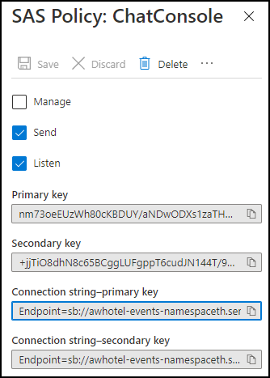
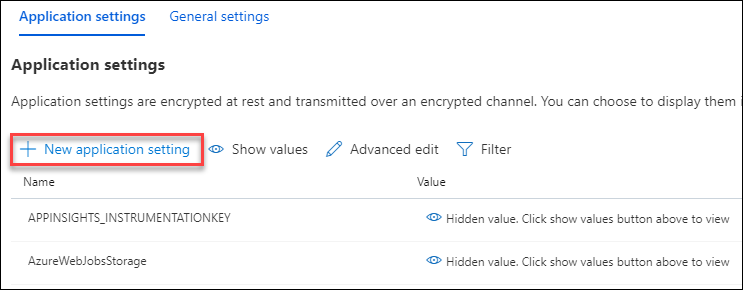
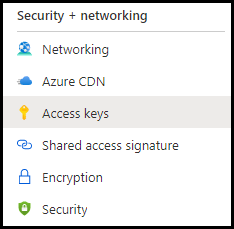
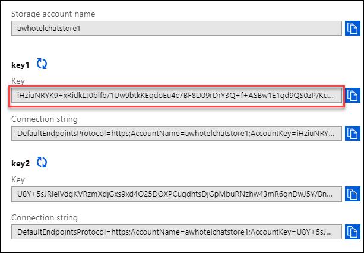
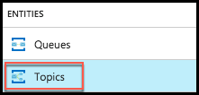
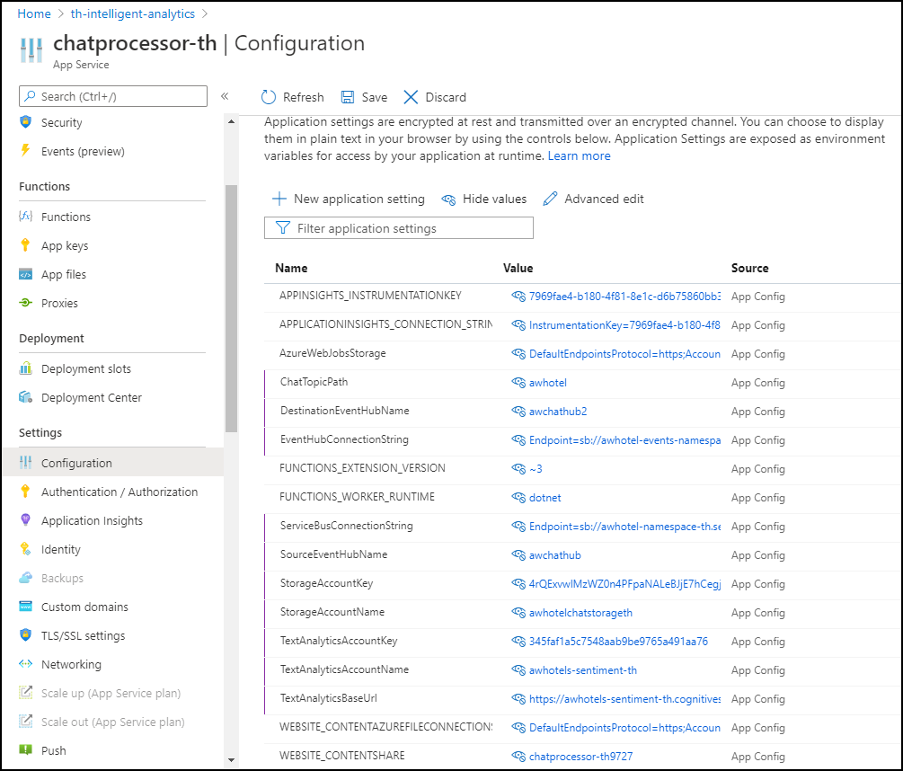

## Exercise 2: Implement message forwarding

Duration: 45 minutes

In this section, you will implement the message forwarding from the ingest Event Hub instance to an Event Hub instance and a Service Bus Topic. You will also configure the web-based components, which consist of two parts: The Web App UI and the Function App that runs the EventProcessorHost.

### Task 1: Implement the event processor

1. On your Lab VM, open the **ConciergePlusSentiment.sln** file that you downloaded using Visual Studio, if it is not already open.

2. Open **ProcessChatMessage.cs** (found within the **ChatMessageSentimentProcessorFunction** project in the Solution Explorer).

    

3. Scroll down to the **Run** method. This method represents the heart of the message processing logic utilized by the Event Processor Host running in an Azure function. It is provided a collection of EventData instances, each of which represent a chat message in the solution.

    

4. Locate **TODO: 1** through **TODO: 5** comments and uncomment the code:

    ```csharp
    //TODO: 1.Extract the JSON payload from the binary message
    string sourceEventHubEventBody = Encoding.UTF8.GetString(eventData.Body);
    var sentimentMessage = JsonConvert.DeserializeObject<MessageType>(sourceEventHubEventBody);

    //TODO: 6 Append sentiment score to chat message object
    //if (sentimentMessage.messageType.Equals("chat", StringComparison.OrdinalIgnoreCase))
    //{
    //    sentimentMessage.score = await GetSentimentScore(sentimentMessage);
    //    log.LogInformation("SentimentScore: " + sentimentMessage.score);
    //}

    //TODO: 2.Create a Message (for Service Bus) and EventData instance (for EventHubs) from source message body
    var updatedMessage = JsonConvert.SerializeObject(sentimentMessage);
    var chatMessage  = new Message(Encoding.UTF8.GetBytes(updatedMessage));

    // Write the body of the message to the console.
    log.LogInformation($"Sending message: {updatedMessage}");

    //TODO: 3.Copy the message properties from source to the outgoing message instances
    foreach (var prop in eventData.Properties)
    {
        chatMessage.UserProperties.Add(prop.Key, prop.Value);
    }

    //TODO: 4.Send chat message to Topic
    // Send the message to the topic which will be eventually picked up by ChatHub.cs in the web app.
    await topicClient.SendAsync(chatMessage);

    //TODO: 5.Send chat message to next EventHub (for archival)
    using var eventBatch = archiveEventHubClient.CreateBatch();
    EventData updatedEventData = new EventData(Encoding.UTF8.GetBytes(updatedMessage));

    eventBatch.TryAdd(updatedEventData);
    await archiveEventHubClient.SendAsync(eventBatch);
    Console.WriteLine("Forwarded message to event hub.");
    ```

5. Save the file.

### Task 2: Configure the Chat Message Processor Function App

1. Navigate to your Function App in the [Azure portal](https://portal.azure.com). You can find it by opening your **intelligent-analytics** Resource Group and looking through the list of resources.

2. Select the **Configuration** link in the **Overview** blade of the **Function App**. Choose the **Application settings** link.

    

3. You will add the following application settings. The following sections walk you through the process of retrieving the values for the Application settings.  If you have already captured these values, you can skip ahead to the adding the **New application setting**.

    ```text
    ChatTopicPath  (e.g. awhotel)
    DestinationEventHubName  (e.g. awchathub2)
    EventHubConnectionString

    ServiceBusConnectionString
    SourceEventHubName   (e.g. awchathub)
    StorageAccountKey
    StorageAccountName

    TextAnalyticsAccountKey
    TextAnalyticsAccountName
    TextAnalyticsBaseUrl
    ```

    > **Note**: It is beneficial to open a second tab or browser window and access the Azure Portal. This way one instance of the Azure Portal may be used to populate the application settings, and the second one can be used to navigate to different resources to obtain key values, connection strings, and URLs. If you decide to use only a single instance of the Azure Portal, be sure to **Save** application settings (available in the Application Settings toolbar) before leaving the screen.

#### Event Hub connection string

Capture the Event Hub connection string.

1. To get the **EventHubConnectionString**, navigate to the Event Hub namespace in the Azure Portal by selecting **Resource Groups** on the left menu, then selecting the **intelligent-analytics** resource group, and selecting your **Event Hubs Namespace** from the list of resources.

    

2. Select **Shared access policies**, under **Settings**, within the left-hand menu.

3. Select the **ChatConsole** from the list of policies, and then copy the **Connection string--primary key** value.

    

4. Return to the **Application Settings** for the Function App in the [Azure portal](https://portal.azure.com) by selecting the **Configuration** link on the Overview pane. Select **+ New application setting** in the toolbar menu of the Application Settings section.

    

5. Enter `EventHubConnectionString` into the **Name** field, and paste the copied connection string value from step 6 into the **Value** field. Select the **OK** button.

    

#### Event Hub name

Your event hubs can be found by going to your Event Hub overview blade, and selecting Event Hubs from the left menu.


1. Create a new application setting with the **Name** `SourceEventHubName`. For the Value, enter the name of your first Event Hub, `awchathub`.

2. Create a new application setting with the **Name** `DestinationEventHubName`, enter the name of your second Event Hub, `awchathub2`, as the **Value**.

#### Storage account

Your storage accounts can be found by going to the intelligent-analytics resource group, and selecting the Storage account.

1. Create a new application setting with the **Name** `StorageAccountName` and enter the name of the storage account you created in the **Value** field.

2. Create a new application setting with the **Name** `StorageAccountKey` and enter the Key for the storage account you created (which you can retrieve from the Portal).

    - From your storage account's blade, select **Access Keys** from the left menu, under **Security + networking**.

      

    - Copy the Key value for **key1**, and paste that into the value for **StorageAccountKey**. You may need to select **Show keys** first.

      

#### Service Bus connection string

1. Navigate to the **Service Bus Namespace Overview** page. From the left menu, select the **Shared Access policies** link in the **Settings** section. Select the **ChatConsole** from the list of policies and copy the **Primary Connection String** value and paste into your text file.

    

2. Return to the Function App's Application Settings and create a new setting with the **Name** `ServiceBusConnectionString` and paste this connection string as the **Value**.

#### Chat topic

1. Create a new application setting with the **Name** `ChatTopicPath`. Enter the name of the Service Bus Topic you had created (e.g., `awhotel`) as the **Value**. This can be found under **Topics** on the **Service Bus Namespace Overview blade**.

    

#### Text Analytics API settings

1. In the [Azure portal](https://portal.azure.com), open the Cognitive Service Text API (e.g. **awhotels-sentiment**) in your resource group.

2. On the left-hand menu of the Text API blade, select **Keys and Endpoint**. You will use these configuration values for creating Function Application settings. 

3. Create a new application setting with the **Name** `TextAnalyticsBaseUrl` and enter the **ENDPOINT** as the **Value**. **Use all lower case alpha characters with no spaces**.

4. Create a new application setting with the **Name** `TextAnalyticsAccountName` and paste the value of the Cognitive Service **Name** into the **Value** field.

5. Create a new application setting with the **Name** `TextAnalyticsAccountKey` and paste the value of **KEY 1** of the Cognitive Service into the **Value** field.

6. Scroll to the top of the function **Application Settings** and select **Save** from the toolbar. Your application settings should now resemble the following (to see the hidden values, select the eye icon in the Value column)

    
