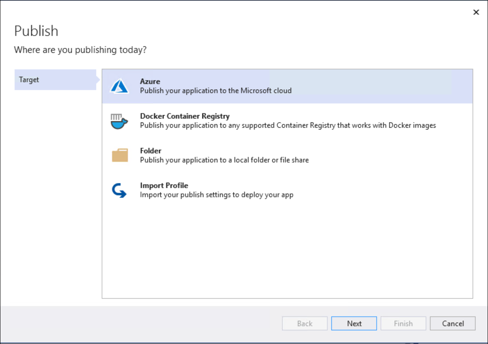
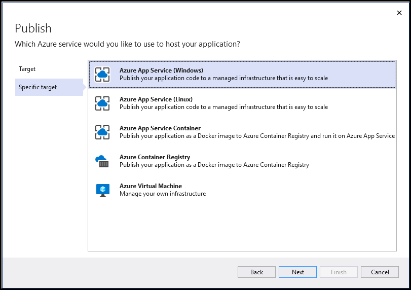

## Exercise 3: Deploying the App Services

Duration: 15 minutes

1. Navigate to the web application and then select the **Configuration** menu item on the left hand side. Add these new application settings, and select **Save** once you are done.  

    ```config
    ChatMessageSubscriptionName  (e.g. ChatMessageSub)
    ChatTopicPath (e.g. awhotel)
    EventHubConnectionString
    ServiceBusConnectionString
    SourceEventHubName   (e.g. awchathub)
    ```

    

With the App Services projects properly configured, you are now ready to deploy them to their pre-created services in Azure.

### Task 1: Restore NuGet Packages for the solution

1. In **Visual Studio Solution Explorer**, right-click on the Solution at the top of the tree, and select **Restore NuGet Packages** from the context menu. Build the Solution.

   

### Task 2: Publish the ChatMessageSentimentProcessor Function App

1. Within **Visual Studio Solution Explorer**, right-click the `ChatMessageSentimentProcessorFunction` project, and select **Publish...** from the context menu.

    

2. In the **Publish** dialog, choose **Azure** as the publish target. Then, select **Next**.

    

3. Select **Azure Function App (Windows)** as the specific target. Select **Next**.

4. In the **Functions instance** tab, choose the **Subscription** that contains your Function App you provisioned earlier. Expand your **Resource Group** (e.g., **intelligent-analytics**), then select the node for your **Function App** in the tree view to select it.

    

5. Select **Finish** and then **Publish**.

    

6. When the publish completes, the Output window should indicate success similar to the following:

    

    > **Note**: If you receive an error in the Output window, as a result of the publish process failing (The target "MSDeployPublish" does not exist in the project), expand the Properties folder within the Visual Studio project, then delete the PublishProfiles folder.

### Task 3: Publish the ChatWebApp

1. Within **Visual Studio Solution Explorer**, right-click the ChatWebApp project and select **Publish...** from the context menu.

    

2. In the **Publish** dialog, choose **Azure** as the publish target. Then, select **Next**.

    

3. In the **Specific target** blade, select **Azure App Service (Windows)**.

    

4. In the **App Service** dialog, choose your **Subscription** that contains your Web App you provisioned earlier. Expand your **Resource Group**, **intelligent-analytics**, then select the node for your **Web App** in the tree view to select it.

5. Select **OK** (or **Finish**). Then, publish the app.

6. When the publishing is complete, a browser window should appear with content like the following:

    

    > **Note**: It may take a couple of minutes for the browser to render. You must use a modern browser like Edge. If the site is opened in Internet Explorer, copy the URL from the address bar, open Edge (that you installed earlier), and navigate to the site with Edge instead.

### Task 4: Testing hotel lobby chat

1. Open a browser instance (Edge is recommended for this web app), and navigate to the deployment URL for your Web App.

    - If you are unsure what this URL is, it can be found in two places:

      - First, you can find it on the **ChatWebApp** document in **Visual Studio**, that was opened when you published the Web App.

        

      - Alternatively, this can be found in the Azure portal on the **Overview** blade for your **Web App**.

2. Under the **Join Chat** area, enter your username (anything will do).

3. Leave **Hotel Lobby** selected.

4. Select the **Join** button.

5. The Live Chat should appear. Wait for a 1 minute. The first message warms up the system. You should see a message stating you have connected to the chat service and you have joined the session.

   The **connected** message means you have connected to the web application via SignalR.  The **join** message means you have sent a message to the event hub and the function app Event Hub Trigger copied the message to the service bus topic. Also, the web application has received the message using the topic subscription and pushed it the browser client.

   > **Warning**: Failure to see these messages means your configuration could be incorrect and will cause problems in the next exercises. Debugging steps are listed below.

    

    - Optional: Open the browser console. You should see similar SignalR debug messages.  Check for:
      - A WebSocket message (wss://). If you do not see this message, configure web sockets in your web application.
      - "ReceivedMessage was called." This means the event listener was set up correctly for the Service Bus topic subscription `ChatMessageSub`.

    

6. Open another browser tab and navigate to the web site.

7. Enter `HotelLobby` (no spaces), and select **Join**.

8. From either session, fill in the Chat text box and select **Send**. You can try using @ and \# too, just to seed some text for search.

    

9. Optional: Debugging Chat Messages

    - Event Hub Message Debugging.
      - Navigate back to the Azure Portal and select your resource group.
      - Select the event hub.
      - Select your event hub link.  e.g. awchathub.
      - Select the **Process Data** in the left-hand menu item.
      - Select the **Explore** button.

        

      - Select the **Test query** link.  You may have to grant permissions.
        

        Your chat messages should appear here.  This means your web application and event hub configuration settings are correct. If messages do not show, go back and check your Application Settings. Notice your messages are spread across the different partitions.

        

    - Check your function app.

        > **Note**: _Debugging Tips_: If you navigate to the Azure Function Monitor, you can get more clues to any problems. Below is example of the log output. It can take up to 5 minutes for log entries to display.

        - Select your **ProcessChatMessage** function from the list of functions.

        - Select **Monitor** from the left-hand menu.

        

    

    - Check your Service Bus Subscription activity.
      - Navigate back to your service bus overview.  You should see the message count greater than zero. The web application is going to pull these messages and display them in the browser.

    

10. Test your Stream Analytics Query.

    - Navigate back to your MessageLogger Stream Analytics job.
    - Select the Query item on the left-hand side.
    - Review the Event Hub `Input preview` and the Stream Analytics `Test results`.

    
