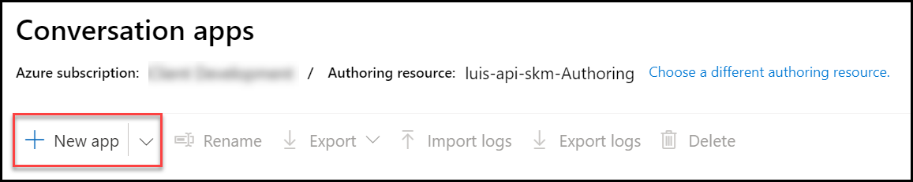
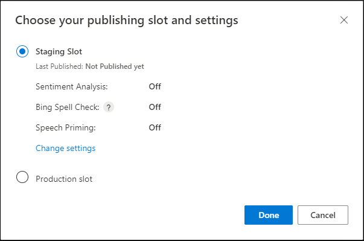
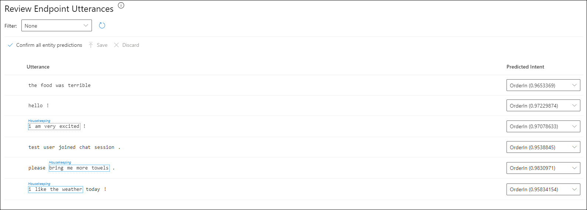
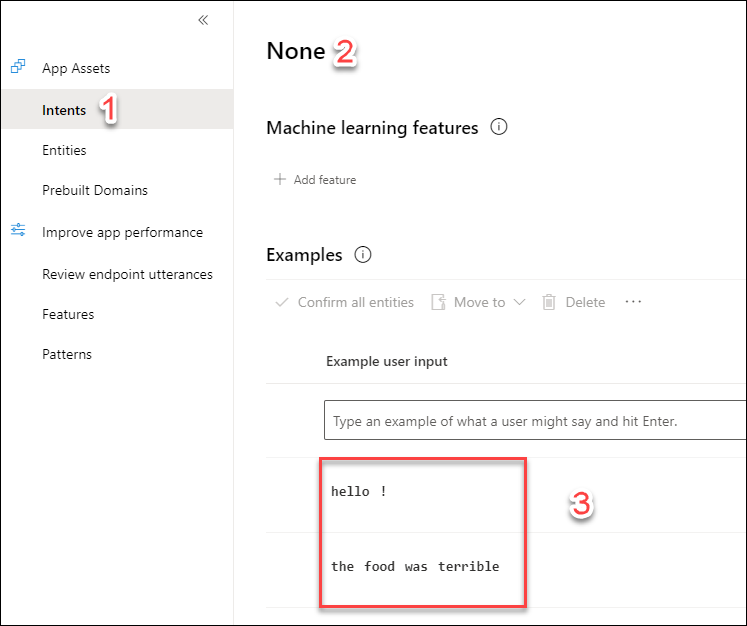

## Exercise 4: Add intelligence

Duration: 60 minutes

In this exercise, you will implement code to activate multiple cognitive intelligence services that act on the chat messages.

### Task 1: Implement sentiment analysis

In this task, you will add code that enables the Event Processor to invoke the Text Analytics API using the REST API and retrieve a sentiment score (a value between 0.0, negative, and 1.0, positive sentiment) for the text of a chat message.

1. In the **Solution Explorer** in **Visual Studio**, open **ProcessChatMessage.cs** in the **ChatMessageSentimentProcessorFunction** project.

2. Scroll down to the method **Run**.

3. Uncomment the code for **TODO: 6**. It should look like:

    ```csharp
    //TODO: 6 Append sentiment score to chat message object
    if (sentimentMessage.messageType.Equals("chat", StringComparison.OrdinalIgnoreCase))
    {
        sentimentMessage.score = await GetSentimentScore(sentimentMessage);
        log.LogInformation("SentimentScore: " + sentimentMessage.score);
    }
    ```

4. Build your **ChatMessageSentimentProcessFunction** project.
5. Publish your **ChatMessageSentimentProcessFunction** project to Azure.
6. Test your sentiment query by selecting the sentiment query and selecting the `Test selected query` button.  Check your results.  Look at the **score** column. You should have all of the negative chat messages. Sentiment analysis has not been applied just yet. The sentiment analysis will be tested after the Language Understanding configuration has been completed.

    

### Task 2: Implement linguistic understanding

What is the hotel guest's intention?

In this task, you will create a LUIS app, publish it, and then enable the Event Processor to invoke LUIS using the `Microsoft.Azure.CognitiveServices.Language.LUIS.Runtime` NuGet package. You will be setting up the LUIS model hierarchy and executing these steps.


1. Using a browser, navigate to <http://www.luis.ai>.  

    > **Note**: If in Exercise 1, Step 12 you created your Luis account in Azure in a European region (e.g. West Europe), user <http://eu.luis.ai> instead. If you selected an Australian region use <http://au.luis.ai>.

2. Select **Login / Sign Up**.

3. Sign in using your Microsoft account (or \@Microsoft.com account if that is appropriate to you). The new account startup process may take a few minutes. If you are prompted to migrate to the Preview version of the LUIS portal, select **Migrate Later**.

4. On the **Welcome to the Language Understanding Intelligent Service (LUIS)!** window, select the appropriate Azure subscription in your tenant.

5. If you are prompted to **Choose an Authoring resource**, select the **luis-api-namespace-Authoring** resource and select **Done**

6. Select **Accept** terms button.

7. You should be redirected to the **Conversation apps** list page. In the toolbar, select **+ New app**.

    

8. Complete the **Create a new app** form by providing `awchat` as the name for your LUIS app, selecting the **English** culture, selecting the **luis-api-namespace** prediction resource, and then selecting **Done**.

    

9. Scroll through the examples of how to create the intents and utterances. Close the dialog.

10. In a moment, your new `awchat` app will appear.

11. Choose **Build** from the toolbar. In the **Intents** pane, select **+ Create** link.

    

12. In the **Intents** dialog, for the **Intent Name** enter `OrderIn` and select **Done**.

    

13. Select **Entities** from the menu on the left.

    

14. Select **+Create**.

    

15. For the **Entity name**, enter **RoomService**.  Select the **Create** button.

    

16. Return to the **OrderIn** intent screen to enter `utterances`.

    

17. In the example input text box, enter the "order a pizza" utterance and **press the Enter key to save your work**.

18. Your newly created pizza utterance is shown below. Select the utterance with your mouse and associate it with the RoomService entity in the dropdown. Upon entity selection, your work will be saved.

    

    Your work is saved automatically.

    
19. Time to train your model.  Select the Train button in the upper right.  You should see the following result:

    

20. Now, it is time to test your model.  Select the Test button. Type in, "I would like to order a pizza" into the text box and select the `Enter` key. Select the **Inspect** link. You should see a correlation result above to 90% as well as the associated ML entity.

    

    It is important to see a high correlation (above .75) and a resulting ML entity because the chat application needs it in order to send the message to the correct hotel department. Below is the code from the function application that determines if there is an utterance match.

    

21. Repeat this process for the following phrases and associate them with the **RoomService** entity:

    - I am hungry
    - order food
    - order a hamburger
    - order a soda
    - order dinner
    - order breakfast
    - order a drink

22. Create a **Housekeeping** entity. It is also a **Machine learned** entity.

23. Create the following utterances and associate them with the Housekeeping entity. To do this, select **Intents** and **OrderIn**.

    - more towels
    - more blankets
    - room too warm
    - room too cold
    - I am cold
    - I am too hot

24. Train and test your model.  Did you get the expected test results?

25. Enter one more utterance, `order a hotdog`. There is some new functionality in LUIS. Notice the predicted label/entity may be suggested for you.  Confirm the **RoomService** entity. Train and test your model.

    

    

26. Select **Manage** from the toolbar, then select **Azure Resources** from the left menu. In the **luis-api-namespace** section, the URL is available in the **Example Query** textbox. 

    

27. Select **Publish** at the upper right-hand corner of the page to publish the endpoint. Publish to the **Staging Slot** and select **Done**.

    

28. Open a new tab in your browser. Paste the **Example Query** URL into the address bar and modify the end of the URL (the text following q= ) so it contains the phrase `bring me towels` and press **ENTER**. You should receive output similar to the following. Observe that it correctly identified the intent as **OrderIn** (in this case with a confidence of nearly 100%) and the entity as having an entity type of **Housekeeping** (in this case with a confidence score of 97.5%).

    ```json
    {
        "query": "bring me towels",
        "prediction": {
            "topIntent": "OrderIn",
            "intents": {
                "OrderIn": {
                    "score": 0.98740774
                },
                "None": {
                    "score": 0.008991768
                }
            },
            "entities": {
                "Housekeeping": [
                    "bring me towels"
                ],
                "$instance": {
                    "Housekeeping": [
                        {
                            "type": "Housekeeping",
                            "text": "bring me towels",
                            "startIndex": 0,
                            "length": 15,
                            "score": 0.97544956,
                            "modelTypeId": 1,
                            "modelType": "Entity Extractor",
                            "recognitionSources": [
                                "model"
                            ]
                        }
                    ]
                }
            }
        }
    }
    ```

29. Note that LUIS can learn from challenges it faces when it's deployed. For example, if your LUIS endpoint failed to determine entities for the "bring me towels" query, navigate to **Review endpoint utterances** below **Improve app performance**. Once you ensure that the **Predicted Intent** is **OrderIn**, associate the utterance with the proper entity (such as **Housekeeping**). Select **Save**. Then, select **Train** and **Publish**.

    

30. Go back to the **luis-api-namespace** screen. Capture three LUIS values and add them to the Azure Function application settings.

    ```text
    LuisPredictionKey
    LuisBaseUrl
    LuisAppId
    ```

    

31. In the LUIS web page, select the **Publish** button.

    

32. Select the **Production Slot** setting.  Select the **Done** button.

    

33. **Save** your Application Settings. The Event Processor is pre-configured to invoke the LUIS API using the provided App ID and key.

34. Open **Visual Studio** then open **ProcessChatMessage.cs** within the **ChatMessageSentimentProcessorFunction** project, and navigate to the Run method.

35. Locate **TODO: 7** and uncomment the code:

    ```csharp
    //TODO: 7.Respond to chat message intent if appropriate
    var updatedMessageObject = JsonConvert.DeserializeObject<MessageType>(updatedMessage);

    // Get your most likely intent based on your message.
    var intent = await GetIntentAndEntities(updatedMessageObject.message);
    await HandleIntent(intent, updatedMessageObject, topicClient);
    ```

36. Take a look at the implementation of both methods if you are curious how the entity and intent information is used to generate an automatic chat message response from a bot.

37. Save the file.

### Task 3: Re-deploy the function application and test

Now that you have added sentiment analysis and language understanding to the solution, you need to re-deploy the apps so you can test out the new functionality.

1. Build and Publish the **ChatMessageSentimentProcessorFunction** Function App using **Visual Studio**.

2. Open the Hotel Lobby web page. Join a chat in the **Hotel Lobby**.

3. Type a message with a positive sentiment, like `I love this weather`. Observe the **thumbs-up** icon that appears next to the chat message you sent. Next, type something like, `I hate this weather` and observe the **thumbs-down** icon. These are indicators of sentiment (as applied by your solution in real-time).

    

4. Next, try ordering some items from room service, like `bring me towels` and `order a pizza`. Observe that you get a response from the **ConciergeBot**, and that the reply indicates whether your request was sent to **Housekeeping** or **Room Service**, depending on whether the item ordered was a room or food item.

    

### (Optional) Task 4: Improve LUIS Model Performance

As mentioned previously, LUIS captures challenging queries from production use and allows developers to improve, train, test, and deploy their Language Understanding models. The key component that supports this feature is the `log=true` query parameter that is part of the LUIS endpoint.

1. In [LUIS](luis.ai), select the **awchat** conversation app.

2. Select **Review endpoint utterances** below **Improve app performance**.

    

3. Consider the first utterance shown above (`the food was terrible`). As this is not a request, and should thus not be routed to neither the Housekeeping nor RoomService entities, the developer must change the **Predicted Intent** to **None**. Then, they must select **Save utterance**.

4. Same applies to the `hello!` utterance. It is not a request, so the developer will change the predicted intent to **None**.

    >**Note**: Is it possible to define an intent for greetings, given that customers will likely issue a greeting before conversing through the app? Will that add value to the app? What entities could you associate with a greetings intent? Defining a logical schema is a critical part of using LUIS.

5. Move test entries that have incorrectly been classified as requests to the **None** intent. Notice how those utterances are now accessible under the **None** intent.

    

6. Once you've dealt with the suggested utterances, **Train** and **Test** the LUIS model.
