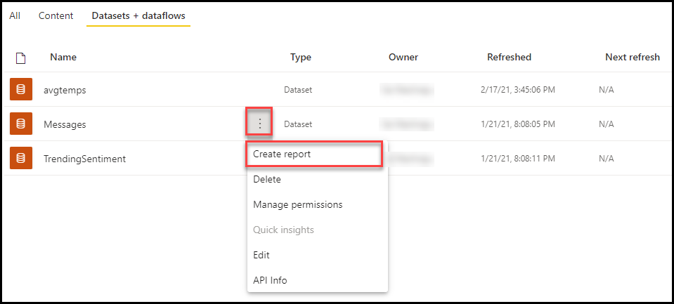
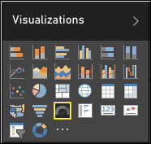
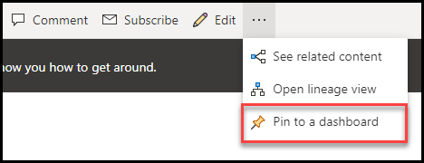
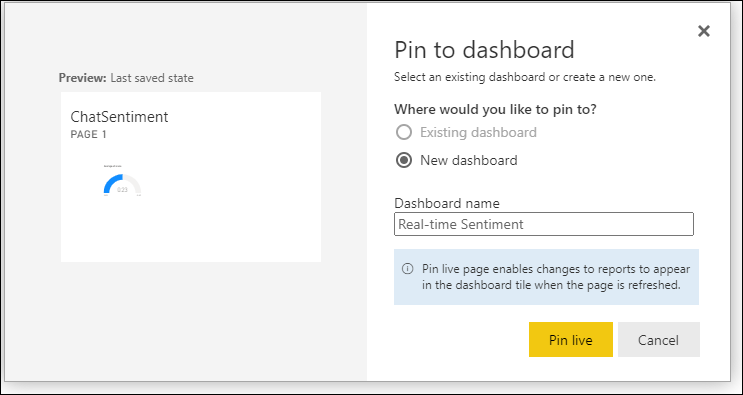
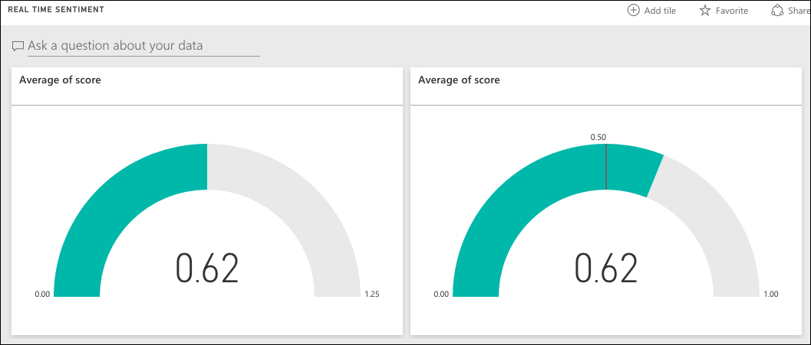
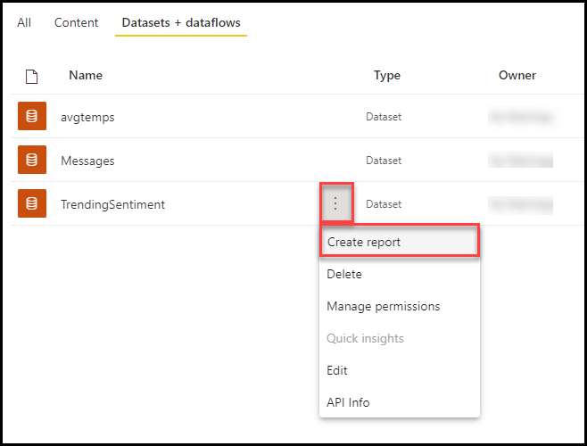
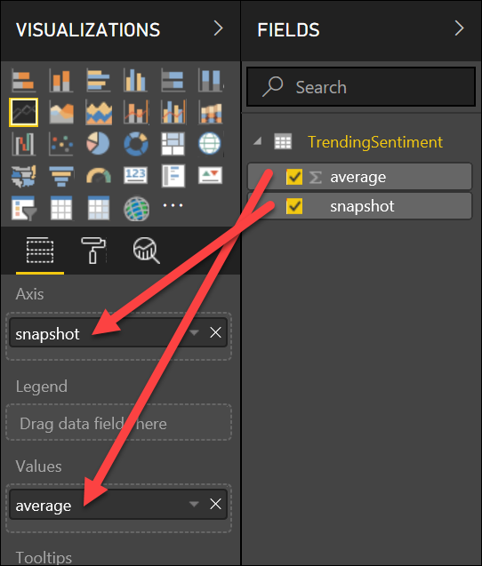
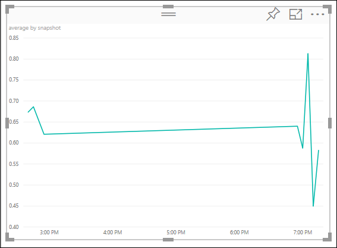
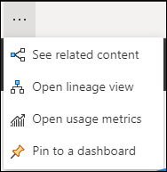
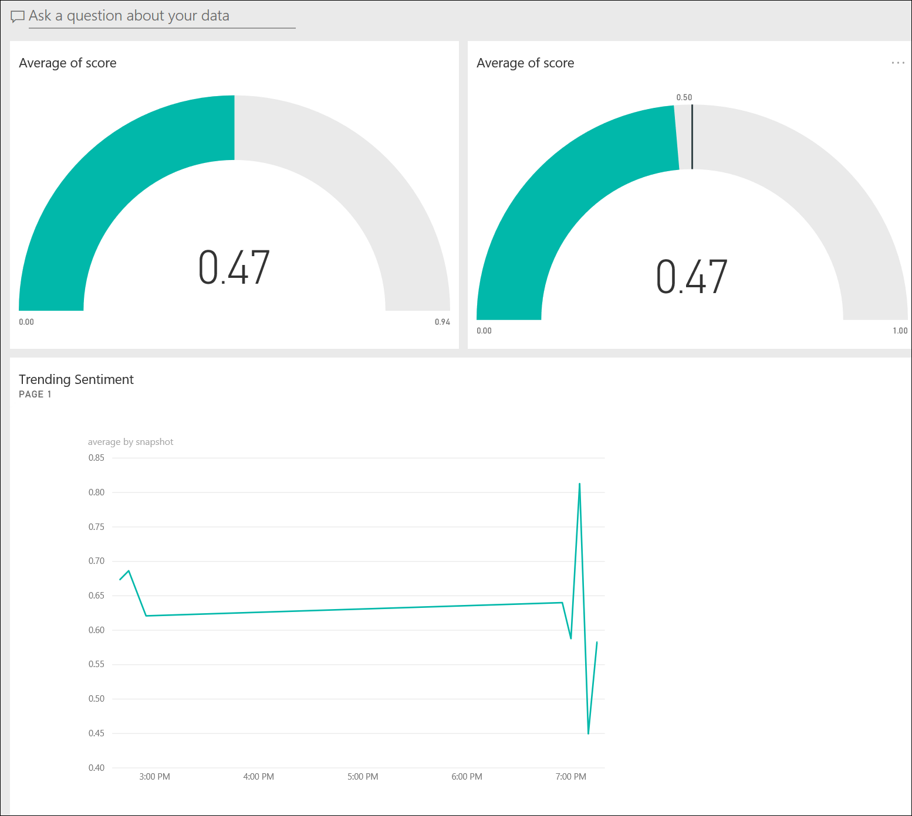

## Exercise 5: Building the Power BI dashboard

Duration: 30 minutes

Now that you have the solution deployed and exchanging messages, you can build a Power BI dashboard that monitors the sentiments of the messages being exchanged in real time. The following steps walk through the creation of the dashboard.

### Task 1: Provision Power BI and Create the static dashboard

1. Sign in to your Power BI subscription (<https://app.powerbi.com>).

2. Select **My Workspace** on the left-hand menu, then select the **Datasets** tab. Depending on your Power BI version, it may read **Datasets + dataflows**.

    

3. Under the **Datasets** (or **Datasets + dataflows**) list, select the **Messages** dataset.

    

4. Select the **Create report** button after clicking the three dots.

    

5. On the **Visualizations** palette, select **Gauge** to create a semi-circular gauge.

    

6. In the **Fields** listing, select and drag the **score** field and drop it onto the **Value** field.

    

7. Select the drop-down menu that appears where you dropped score and select **Average**.

    

8. You now should have a gauge that shows the average sentiment for all the data collected so far, which should look similar to the following. If you have not sent many messages, the average sentiment may be a negative value, as the chat processor set a sentiment of -1 before you implemented proper Text Analytics sentiment analysis.

    

9. From the **File** menu, select **Save** to save your visualization to a new report.

    

10. Enter `ChatSentiment` for the report name, and select **Save**.

    

### Task 2: Create the real-time dashboard

This gauge is currently a static visualization. You will use the report just created to seed a dashboard whose visualizations update as new messages arrive.

1. Select the **Pin to a dashboard** item located on the toolbar. You will need to select the three dots to find this item.

    

2. Select **New dashboard**, enter `Real-time Sentiment` as the name, and select **Pin Live**.

    

3. Return to the **My Workspace** page, and select your newly created dashboard from the list of dashboards.

    

4. Real-time dashboards are created in Power BI using the Q&A feature, by typing in a question to visualize in the space provided. In the **Ask a question about your data** field, enter: `average score created between yesterday and today`.

    

    

5. Next, convert this to a Gauge chart by expanding the **Visualizations** palette at right, and selecting on the **Gauge** control. You will need to set the **New Q&A experience** to **Off** in order to see the **Visualizations** palette. This switch is on the toolbar on the right-hand side.

    

6. In the **Visualizations** palette, select the **Gauge** control. Select the **Format** (paint roller) icon and expand the **Gauge axis** section. Format the Gauge axis so it ranges between **0.0** and **1.0** and has a **target** (indicator) set at **0.5**.

    

7. Your gauge should now look similar to the following:

    

8. In the top-right corner, select **Pin visual**.

    

9. In the dialog that appears, select the dashboard you recently created and select **Pin**.

    

10. In the list of dashboards, select your **Real-time Sentiment** dashboard. Your new gauge should appear next to your original gauge. If the original gauge fills the whole screen, you may need to scroll down to see the new gauge. You can delete the original gauge if you prefer. (Select the top of the visualization, then ellipses that appear, and then, the trash can icon.)

    

11. Navigate to the chat website you deployed and send some messages and observe how the sentiment gauge updates with moments of you sending chat messages.

### Task 3: Add a trending sentiment chart to the dashboard

The sentiment visualization you created is great for getting a sense of sentiment as of this moment. However, First Up Consultants wishes to view sentiment over time for historical reference and to see whether overall sentiment is trending one way or another. To do this, we will use the tumbling window query output from Stream Analytics to display this data in a line chart.

1. While still in **Power BI**, select **My Workspace** once again, then select the **Datasets** (or **Datasets + dataflows**) tab. You should see the **TrendingSentiment** dataset dynamically created by Stream Analytics. Select the **Create Report** action.

    

2. Select the **Line chart** visualization.

    

3. Drag the **average** field to the **Values** setting, and **snapshot** to **Axis**.

    

4. Resize the line chart and observe how the average sentiment is tracked over time.

    

5. Select **Save this report** on the top of the page. Name the report `Trending Sentiment` when prompted.

    

6. Next, select **Pin to a dashboard**.

    

7. In the **Pin to dashboard** dialog, select **Existing dashboard**, select the dashboard you created previously, then select **Pin live**.

    

8. Position the Trending Sentiment line chart beneath the average score gauge.

    

9. Try building out the rest of the real-time dashboard that should look as follows. We provide the following Q&A questions you can use to get started.

    

    - Count of Messages (Card visualization): Count of messages between yesterday and today.

    - Count of Messages by Username (Pie chart visualization): Count of messages by username between yesterday and today.

    - Upset Users (Bar chart visualization): Average score by username between yesterday and today.

10. Invite some peers to chat and monitor the sentiments using your new, real-time dashboard.
