## Exercise 6: Enabling search indexing

Duration: 30 minutes

Now that you have primed the system with some messages, you will create a Search Index and an Indexer in Azure Search upon the messages that are collected in Azure Cosmos DB.

### Task 1: Verifying message archive

Before going further, a good thing to check is whether messages are being written to Azure Cosmos DB from the Stream Analytics Job.

1. In the **Azure Portal**, navigate to your **Azure Cosmos DB account**.

2. On the left-hand menu, select **Data Explorer**.

    

3. Under the **awhotels** Cosmos DB, select **messagestore**, then **Items**. You should see some data here.

    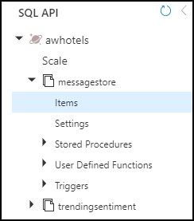

4. If you want to peek at the message contents, select any item in the listing.

    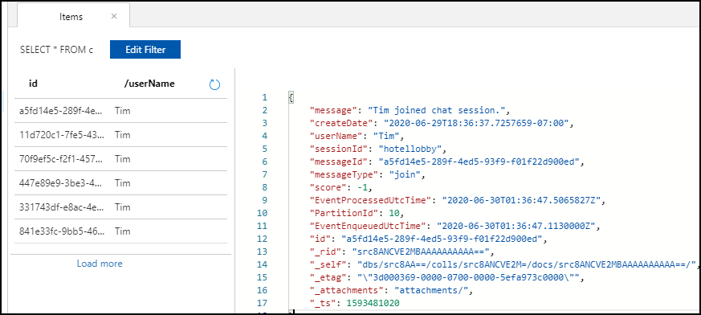

    > **Note**: If you don't see messages, then check for errors in MessageLogger, Outputs, Cosmos DB.  If you have to delete the collection and recreate them, make sure to stop and start the MessageLogger.  Test the connection.

    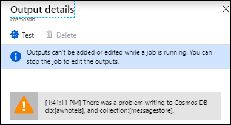

### Task 2: Creating the index and indexer

1. Select **Resource Groups** from the left menu, then select the **intelligent-analytics-<inject key="DeploymentID" enableCopy="false"/>** resource group.

2. Select your **Search service** instance from the list.

    

3. Select **Import data**.

    

4. On the **Import data** blade, select **Connect to your data**.

    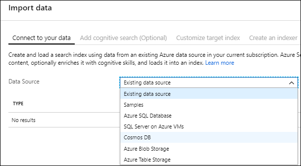

5. For **Data Source**, select **Azure Cosmos DB** from the dropdown.

6. Enter `messagestore` for the **Data Source Name**.

7. **Connection string**: Select the **Choose an existing connection**, and select the **awhotelcosmosdb-namespace** database. This will auto-populate the connection string.

8. For **Database**, select your **awhotels** database.

9. For **Collection**, choose your **messagestore** collection.

    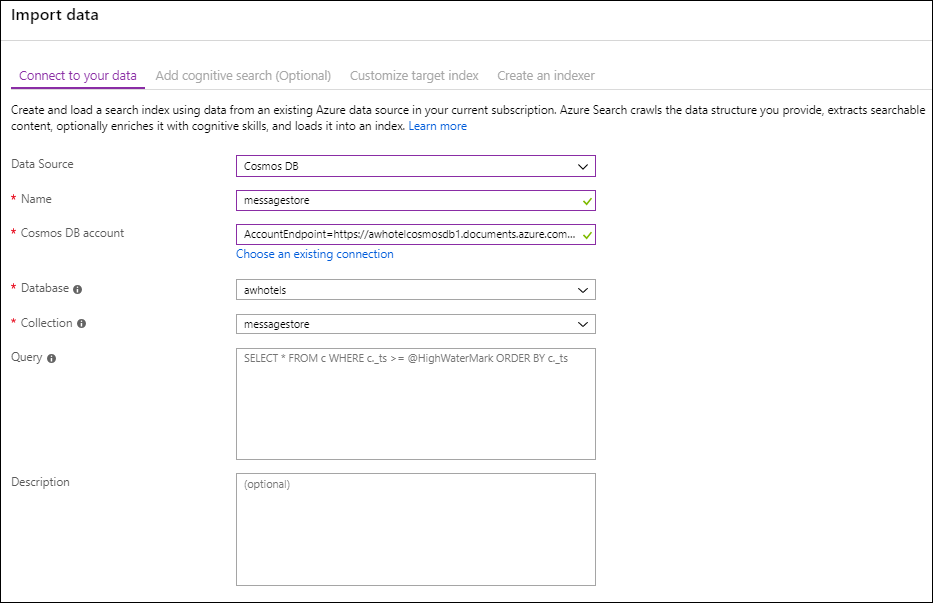

10. Select the **Next: Add cognitive skills (Optional)** button.

    

    Select **Skip to: Customize target index**.

    

11. Select **Customize target index**, and observe that the field list has been pre-populated for you based on data in the collection.

12. Enter `chatmessages` for the name of the index. Capture this value for later web application configuration.

13. Set the Key to **id**

    

14. Select the **Retrievable** check box for the following fields: **message, createDate**, and **username** (id will be selected automatically). Only these fields will be returned in query results.

15. Select the **Filterable** check box for **createDate, username**, and **sessionId**. These fields can be used with the filter clause only (not used by this Tutorial, but useful to have).

16. Select the **Sortable** check box for **createDate**, **username**, and **sessionId**. These fields can be used to sort the results of a query.

17. Select the **Searchable** check box for **message**. Only this field will be indexed for full text search.

18. Confirm your grid looks similar to the following, and select **Next: Create an Indexer**.

    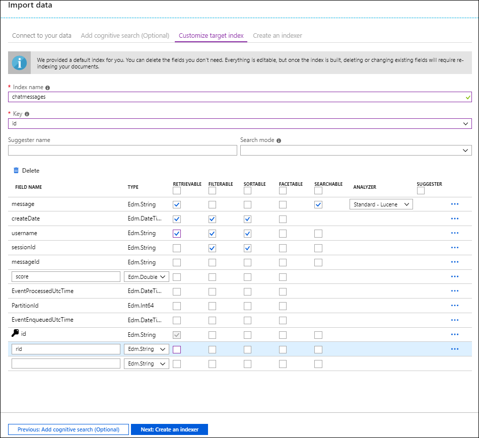

19. On the **Create an Indexer** blade, enter `messages-indexer` as the name.

20. Set the **Schedule** toggle to **Custom**.

21. Enter an **interval** of **5** minutes (the minimum allowed).

22. Keep **Start time** as the default value, which is the current date and time.

23. The description and other fields can be ignored.

24. Select **Submit** to begin importing data using your indexer.

25. You should test your index and configure it to be searchable by client applications. After a few moments, examine the Indexers tile for the status of the Indexer.

    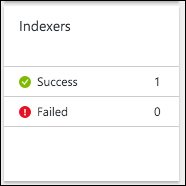

    You should see your messages indexed.

    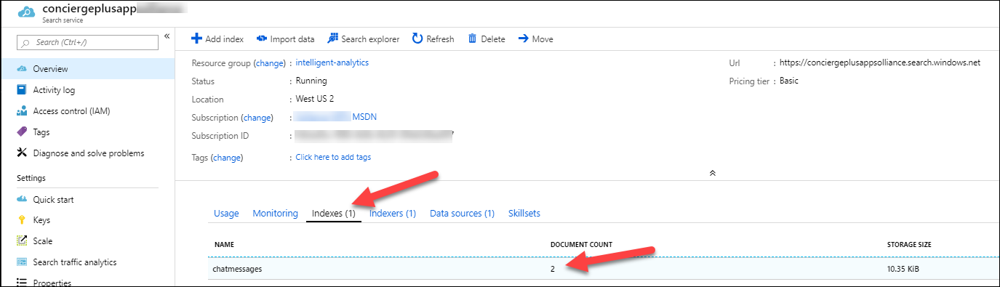

    Select the **chatmessages** index.  You can test the searches by entering values in the **Query string** text box. Enter `search=test` into the Query string box and select **Search**.

    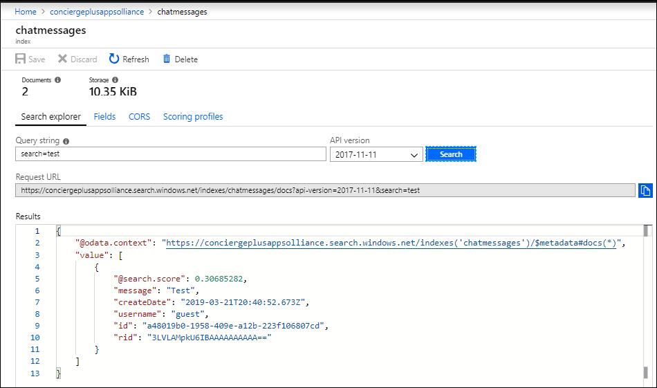

    Select the **CORS** tab. Select **All** for the option. Press the Save button.

    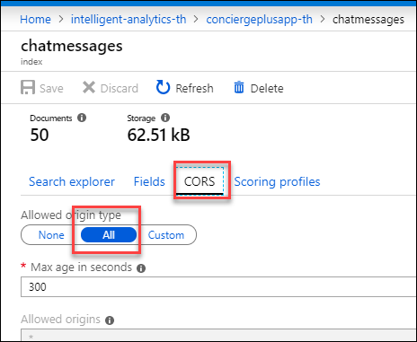

    > **Note**: The **All** setting allows search requests from other client applications to successfully execute. For a production application, you would choose the **Custom** option and enter the domain you will be receiving requests from.

26. We need to capture the index query api key for the Azure Web App configuration.

    - On the **Search service** blade, select **Keys** on the left-hand menu. Capture the **Primary admin key**. The value will be used for the ChatSearchApiKey.

    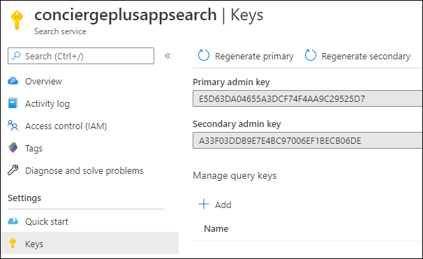

### Task 3: Update the Chat Web App Configuration

1. Navigate to your web app.

2. Select the configuration blade. We are going to add the following values:

    ```text
    ChatSearchApiBase
    ChatSearchApiIndexName (chatmessages)
    ChatSearchApiKey
    ```

3. For the `ChatSearchApiBase` key, enter the URI of the Search App (e.g., <https://conciergeplusappsearchth.search.windows.net)>.

    - You can find this by going to **Resource Groups**, selecting the **intelligent-analytics** resource group, and selecting your **search app service** from the list.

    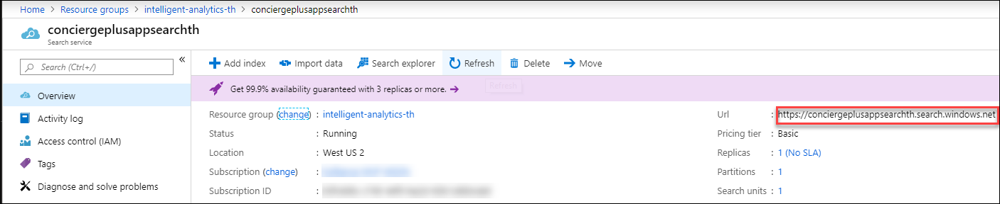

4. Save the web application configuration.

### Task 4: Re-publish web app

1. Publish the updated **ChatWebApp** using Visual Studio, as was shown previously in [Exercise 4, Task 3](#task-3-publish-the-chatwebapp).

2. When the publishing is complete, a browser window should appear.

3. Navigate to the **Search** tab on the deployed Web App and try searching for chat messages.

    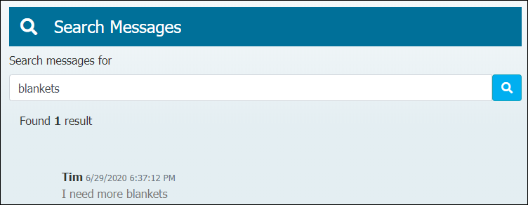
