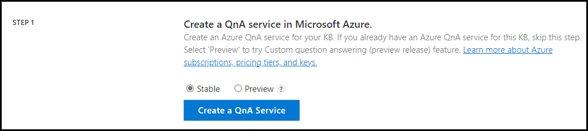
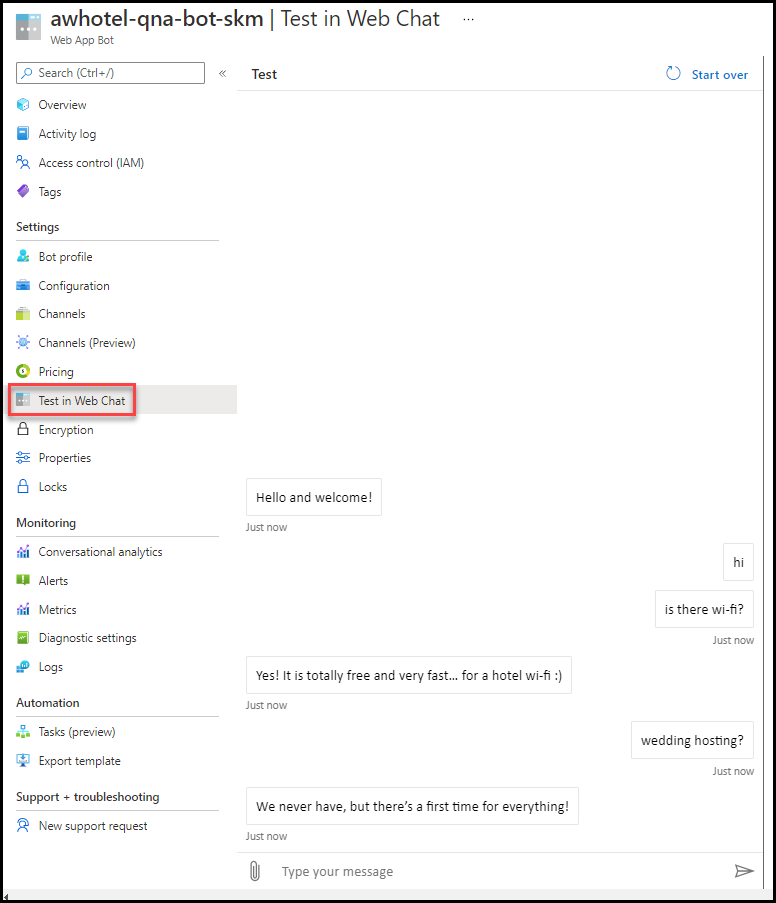

## Exercise 7: Add a bot using Bot service and QnA Maker

Duration: 30 minutes

At this point, you have created a real-time chat service in Azure, allowing people to interact with one another. Now we will build a bot that will automatically respond to user questions, helping take the load off the hotel staff.

### Task 1: Create a QnA service instance in Azure

Microsoft's QnAMaker is a Cognitive Service tool that uses your existing content to build and train a simple question and answer bot that responds to users in a natural, conversational way.

1. In a new web browser window, navigate to <https://www.qnamaker.ai>.

2. On the home page, select **Sign In** on the top right of the page. Sign in with the same credentials you use for the [Azure portal](https://portal.azure.com).

    

3. Select **Create a knowledge base**.

    

4. Within the **knowledge base creation** page, select **Create a QnA Service** under Step 1. Ensure that you configure the **Stable** tier.

    

5. Within the **Create QnA Maker** form in Azure, provide the following:

    - **Subscription**: Choose the same subscription you used previously.

    - **Resource Group**: Choose the **intelligent-analytics** resource group.

    - **Name**: Provide a **unique name** for the QnA Maker Service (e.g., **awhotel-qna-<inject key="DeploymentID" enableCopy="false"/>**).

    - **Pricing tier**: Choose **Free F0 (3 managed documents per month ...**

    - **Azure Search location**: Choose the **same location** you used previously. If the region you've been using isn't available, select a different location for this resource.

    - **Azure Search pricing tier**: Choose **Free F (3 Indexes)**.

    - **App name**: Provide a **unique name** for the QnA Maker Service (e.g., `awhotel-qna`).

    - **Website location**: Choose the **same location** you used previously. If the region you've been using isn't available, select a different location for this resource.

    - **App insights**: Select **Disable**.

    

6. Select **Review + create** and **Create**.

7. Once the service has been created, switch back to the browser tab with the **QnA Maker knowledge base creation** page and select the **Refresh** button in the **Step 2** section.

8. Underneath Step 2, select your **Microsoft Azure Directory ID** under which you created the QnA Maker service, select the **Azure subscription name**, select the **Azure QnA service**, and **English** as the **Language**.

    

9.  Underneath Step 3 (Name your KB), provide a unique name, such as `ConciergePlus`.

10. Underneath Step 4 (Populate your KB), select **+ Add file**. [Upload this file](https://raw.githubusercontent.com/microsoft/MCW-Intelligent-analytics/main/Hands-on%20lab/lab-files/faq.xlsx) to the service.

    

11. Finally, underneath Step 5 (Create your KB), select **Create your KB** (keep **Chit-chat** at its default, **None**).

    

12. When the KB is being created, the Knowledge base will be displayed in the window. It takes a few seconds for the extraction process to read the Excel document and identify questions and answers.

    

13. Select **+ Add QnA pair** in the toolbar to add a new row in the **Editorial** section of the Knowledge Base. Enter `Hi` into the **Question** field and `Hello. Ask me questions about the hotel.` into the **Answer** field of the new row you created.

    

14. Choose **Save and train** button on toolbar of the page. This will save your changes and train the bot how to respond to questions, given the information you imported.

15. Once your changes have been saved, select **Test** at the top of the page. Try typing `hi` and press enter. You should see the **Hello. Ask me questions about the hotel.** response. Experiment with asking different questions.

    

16. Select **Inspect** underneath one of your test questions. The **Inspect** pane will appear, showing the question you typed, the answer, and a confidence score. This pane provides you an easy way to add alternate phrasing or change the answer. Choose **Save and train**. Select the **Test** button to hide the testing pane.

    

17. Select **Publish** on top of the page. In the publish page that appears, select the **Publish** button.

    

### Task 2: Create a QnA bot

1. Select the **Create Bot** button.

    

2. Enter the **Web App Bot** configuration as follows:

    - **Bot handle**: Enter the Bot name, e.g. `awhotel-qna-bot`.
    - **Subscription**: Select your subscription.
    - **Resource Group**: Select **intelligent-analytics**.
    - **Location**: Select the region you've been using throughout this lab.
    - **Pricing tier**: Select **F0 (10K Premium Messages)**.
    - **App name**: This will be defaulted to the same name as the **Bot handle**.
    - **Application Insights**: Set to **Off**.

    > **Note**: Do not change the QnA Auth Key.
    
    > **Note**: You may receive a message that the Resource provider 'Microsoft.BotService' is not registered from the subscription. If this is the case, it can be rectified by following [one of these solutions (choose 1)](https://docs.microsoft.com/en-us/azure/azure-resource-manager/templates/error-register-resource-provider).

    

3. Select the **Create** button.

4. Choose your new **QnA Web App Bot** from the resource group.

    

5. Test out the bot by selecting **Test in Web Chat** on the left-hand menu (it may take a couple minutes to appear the first time). Type in a few questions to make sure it responds as expected.

    

6. Select **Bot profile** from the left-hand menu. Change the display name to something like `Concierge+ Bot`, then select **Apply**.

    

7. Select **Channels** from the left-hand menu, then select **Get bot embed codes** underneath the **Web Chat channel**.

    

8. A dialog will appear for the embed codes. Select the **Click here to open the Web Chat configuration page** option.

9. Select **Copy** next to the **Embed code** textbox. Paste that value to notepad or other text application. Select **Show** beside the first Secret key. Copy the value and replace **YOUR_SECRET_HERE** within the embed code with that secret value. Example: `<iframe src='https://webchat.botframework.com/embed/awhotel-qna-bot-skm?s=EnZZZrVOZjY.KujPgaoTtfxSAMObBCWLTPnvibXExfrXOY3d82nhcMI'  style='min-width: 400px; width: 100%; min-height: 500px;'></iframe>`.

    

### Task 3: Embed the bot into your web app

1. Open **Visual Studio** and open **Bot.cshtml** located within the **Views\Home** folder of the **ChatWebApp**.

    

2. Find `<!-- PASTE YOUR BOT EMBED CODE HERE -->` within the page and paste your iframe embed code on a new line beneath.

3. Modify the iframe style values to match as follows. The iframe code should look like:

    ```html
    <!-- PASTE YOUR BOT EMBED CODE HERE -->
    <iframe src='YOUR_SOURCE' style='min-width: 400px; width: 100%; height: 300px;'></iframe>
    ```

    

4. **Publish** your web app.

5. After the web app has been published, navigate to it by selecting the **Bot** menu item. Type in a few questions to ensure the bot is functioning correctly.

    
